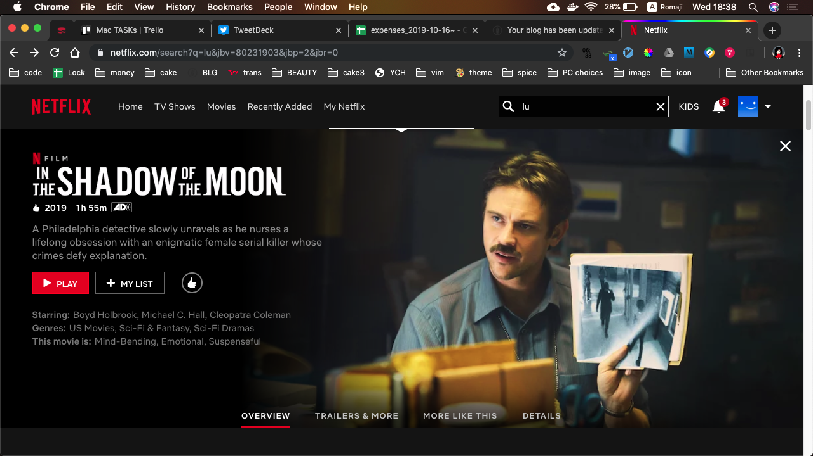

# Watched In The Shadow of The Moon

In the Shadow of the MoonをNetflixで観た．  
ストーリーがよく練られていて，後味の良い作品だった．  

## intro
* 娘の出産を控える主人公の刑事が相棒のMadoxと仲良く仕事を
していると，首を刺されて，耳から脳が溢れる被害の連続殺人事件が
連発する．

* 被害者の一人の読んでいたのは独立宣言起草者の本．

* 容疑者は青いパーカーの黒人の女．非常に強い．
* 主人公は優秀なので追い詰め, 顔を暴く.

* が, 戦っている最中に殺してしまう.

* 事件は収束したよう見え，白人警官が黒人警官を殺害したことで
世論は高まるが，娘と幸せに暮らす主人公．

* うさぎさんパンケーキ可愛い

* しかし9年後，青パーカーが現れ，ふたたび事件は起きる

* 追い詰めるが捕まり，助けに来た相棒は射殺される．

* 女の見た目は変わっておらず，また9年後に現れると
確信した主人公は娘を放って私立探偵で手段を選ばない捜査を
続ける．

* 更に9年後，浮浪者のような生活で事件を追い続ける．
孫娘が産まれる日と，あの青パーカーが来る日が被り，
青パーカーを追うことを選ぶ主人公．

* そこでとうとう彼女を追い詰めて射殺しようとする主人公は
真実を知って，自分が最初に地下鉄で彼女を殺した事実に
泣き崩れる．

* 彼女は自分が殺される過去に戻り，自分が殺される過去に戻り，自分が殺される過去に戻り，自分が殺される過去に戻り，自分が殺される過去に戻り，自分が殺される過去に戻り，自分が殺される過去に戻り，自分が殺される過去に戻り，使命を遂げ，殺される．そして目的は達成される．
憎しみの連鎖，大きな戦争は防がれた．

## 考察
伏線がよく回収されていた．  
9年毎の事件だからそれを追い続ける主人公が，
周りから精神障害者扱いされていくのがきつかった．
27年ものロングスパンの話は他とは重みが違った．
殺害方法も理由があって，話が全て繋がってスッキリした．
お勧めできる良作だった．
