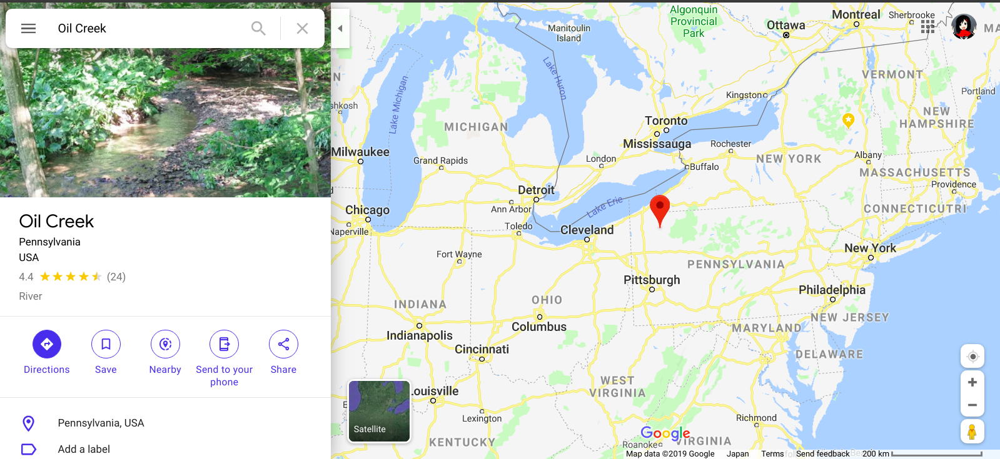

# Oil History
## Key Word
Penssylvania/Titusville/OilCreek, Oli rush, Edwin L Drake, 1859, rock oil,
## History Intro
### starts
It's shallow story.  
Starts after 1859. In Pennsylvania, by Colonel Drake.  
Before that, Oil was discoverd just by surface as `oil seep`.  
Not to ruin crops. Later used alt to `whale oil` for lamp.  

### others??
lorem30
### As lamp
After Drake, Americans started to use petroleum as warmer or light.  
With indestorialization, urbanization, lights to new century, 
more convinient life generalization and proceed background,
New market existed. 
So enough amount, simplicity, safety are needed.  
In this condition, produce, circulation, handy price.  
### Production
This industory appeared in the 19c, rapidly update human living 
environment in 20c.  
In 1873, a million tons.  
1900: 10 million tons.
1931: 100 million tons.
1950: 1 billion tons.
1979: 3 billion tons.  
No other industory expand like this.
### flow
Petrolem is the main matterial of this world which energy is based on 
every industorial dev, economy dev and personal happiness.  
This energy can easily vaporized.  
Petrolem Com became big scale.  

1849, Kier extaract oil from saltwater wells. 
and found its same as medical oil.  
Kier became wealthy. 
1850s, He started drill for crude oil. 
Then inventors and scientists started to use for energy.  

---
ch01
## Petrolem Industory starts
### Drake
He was working in mine, did many things.  
In Pennsylvania, Titusville,  
Geroge Bissell, a NW loyer formed the Penn Rock Oil Company.
He hired Edwin Laurentine Drake (1819-1880) as a leader.  
He speaks Big and Strong Voice. He was called Colonel Drake.  
In 1857, the project started. It took long time, said Drake's folly, 
but he never stopped. In 1859.08.27, Petrolem welled up.  
### Petroleum Period.
entrepreneurs, many workers, service and equipment supplier, 
many people gathered in Titusville.  
1861: 3000 barrel (160L * 300)

## words
gas == rock oil == petroleum == crude oil

## ref
https://en.wikipedia.org/wiki/Pennsylvania_oil_rush
[Petrolem History ]
book P.10
[First American Oil Well]
(https://aoghs.org/petroleum-pioneers/american-oil-history/)

