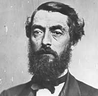
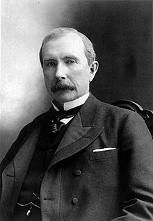
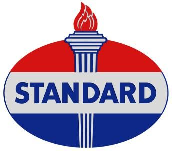
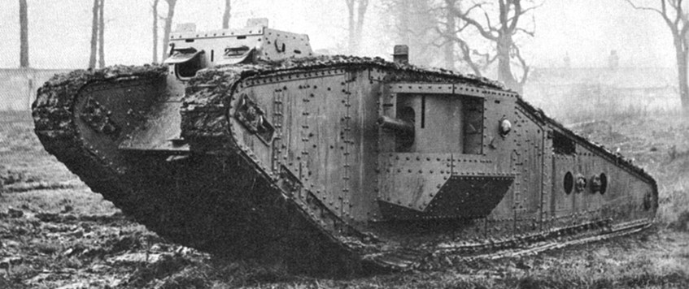

# Oil History
## Key Word
Penssylvania/Titusville/OilCreek, Oli rush, Edwin L Drake, 1859, rock oil,
## History Intro
### starts
It's shallow story.  
Starts after 1859. In Pennsylvania, by Colonel Drake.  
Before that, Oil was discoverd just by surface as `oil seep`.  
Not to ruin crops. Later used alt to `whale oil` for lamp.  

### As lamp
After Drake, Americans started to use petroleum as warmer or light.  
With indestorialization, urbanization, lights to new century, 
more convinient life generalization and proceed background,
New market existed. 
So enough amount, simplicity, safety are needed.  
In this condition, produce, circulation, handy price.  

### Production
This industory appeared in the 19c, rapidly update human living 
environment in 20c.  
1873: a million tons.  
1900: 10 million tons.  
1931: 100 million tons.  
1950: 1 billion tons.  
1979: 3 billion tons.  
No other industory expand like this.
### flow
Petrolem is the main matterial of this world which energy is based on 
every industorial dev, economy dev and personal happiness.  
This energy can easily vaporized.  
Petrolem Com became big scale.  

1849, Kier extaract oil from saltwater wells. 
and found its same as medical oil.  
Kier became wealthy. 
1850s, He started drill for crude oil. 
Then inventors and scientists started to use for energy.  

## Petrolem Industory starts
### Drake
He was working in mine, did many things.  
In Pennsylvania, Titusville,  
Geroge Bissell, a NW loyer formed the Penn Rock Oil Company.
He hired Edwin Laurentine Drake (1819-1880) as a leader.  
He speaks Big and Strong Voice. He was called Colonel Drake.  
In 1857, the project started. It took long time, said Drake's folly, 
but he never stopped. In 1859.08.27, Petrolem welled up.  

### Petroleum Period.
entrepreneurs, many workers, service and equipment supplier, 
many people gathered in Titusville.  
1861: Dialy 3000 barrel (1 barrel 160L) production well appeared.  
1860: Under 10t by a year, 1862: 50t.  
Then price rapidly down. In 1861 $20 to 10s cent by 1 barrel.  
But lamp oil's market became bigger, so the price of a barrel 
recovered to $7 ~ $8. However supply increase again, so the price 
down to around $1. To ajust the price, market is built eventually.  
Through this, petroleum lamp got popular, and said "The most beautiful
light" in America, and exported Europe. Petrolem market is open 
internationaly.  

### Rockfeller
founder of the Standard Oil Company, world’s wealthiest men.  
Born in 1839, diligent and economical man. No alcohol and smoke.  
Has high mental arithmetic skill, superior from a child.  
1855, At 16, worked as an office clerk, at 20 established their own commission firm. 
1863, Rockefeller and several partners entered the booming new oil industry 
He updated every quipment for petroleum trade, manage all cost. And used pipeline for 
both materials and product.

### Standard Oil
1870.01.10 starts. 'Standards' from the best quarity of the market. Negotiated to 
train company, by the massive transport amount, got discount.  
1879 Pipline battle against union of Penn starts. They made huge pipeline 
connect oil production region and Penn and Reading Train station. 
It reduce cost a lot, but Standard Oil made 4 pipeline in 2 years, 
It ruled the market of 80%.  
1888, German scientist Helman get rid of H2S from petroleum, ruled production.  

### Russ Oil
Rothchild and Nobel are 20 ~ 30% of the Europe Oil. 

### Other Company
Pure Oil formed trust in 1895, had 14 refinery, 500k ton petroleum, 
3 Million Meter Pipeline, tankers, but other include Melon are eaten 
by Standard Oil.  

## Before war
1900s, 50 years from oil industory, market is growing and expanding, 
Used by lamp, cars, boiler, machine oil, so production, refine, 
and transport tech are developed eventually. Proceed. Standard is dead, 
Mexico, Venezuela, Middle East joined this industory.

### WWI
Cars replaced horses, planes starts to attack, internal combustion engine 
made `tank`. Diesel engine update submrine. Cousuming Peek was 1918. 
This `Oil Wave` brought Allies win. `Blood of the earth ` for win. 

### After WWII
America stayed the leader of the world. Production ability is always over 
demand, price is dropping. By geological observation and analize, and 
identification century of the hole digged, especially earth physics, 
digging technology proceeded, safer and faster. New system Proportional 
distribution stabled oil price. 

### WWII
Japan and Germany suffered from lacking oil. In 1994, America take Pacific 
Ocean back again, so Japanse oil was almost 0 at end of the war.  
However allies had enough oil. France and UK stored enough oil, and managed 
well, America boost oil prodcution. 

## words
gas == rock oil == petroleum == crude oil

## ref
[Wikipedia/Penssylvania oil rush]
(https://en.wikipedia.org/wiki/Pennsylvania_oil_rush )
[Petrolem History]
(book P10+)
[First American Oil Well]
(https://aoghs.org/petroleum-pioneers/american-oil-history/)
[history.com/John D. Rockefeller]
(https://www.history.com/topics/early-20th-century-us/john-d-rockefeller)
[World War 1 History: First Tank Versus Tank Battle]
(https://owlcation.com/humanities/WWI-First-Tank-Versus-Tank-Battle)

